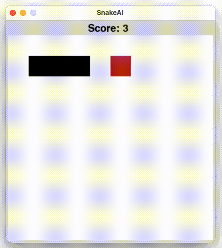

# SnakeAI
This is a simple snakeAI that is made using genetic algorithm and neural networks.

### Requirements
1. Python 3.7 or higher
2. Pygame 2.0 or higher

### How To Run
1. Clone the repository
2. Run the snake.py file
3. Press the left arrow key to stop snake visualisation (to make the training process faster)
4. Press the right arrow key to resume snake visualisation

### Author
Shifa Salsabiila
